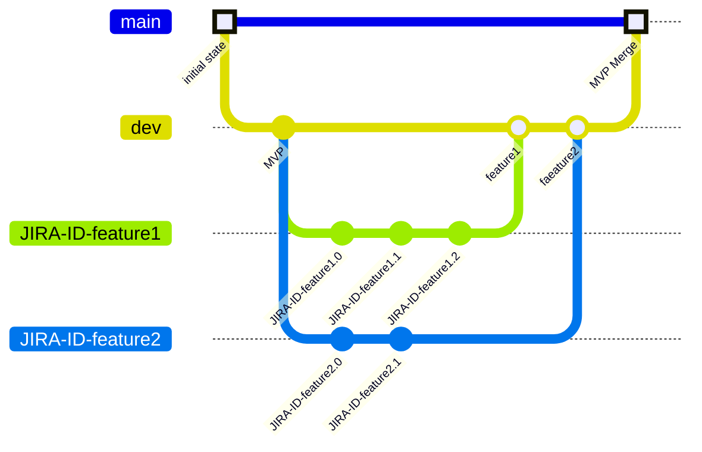
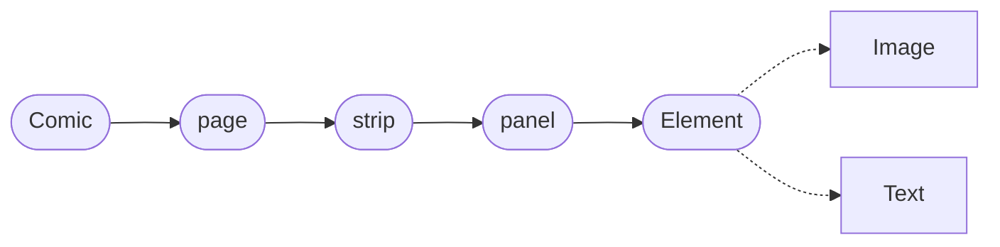

# GIT guideline

This is the guideline for the Git Project: comixcraft. The branching strategy is based on the [GitFlow workflow](https://www.atlassian.com/git/tutorials/comparing-workflows/gitflow-workflow#:~:text=What%20is%20Gitflow%3F,by%20Vincent%20Driessen%20at%20nvie.)

Repository url: [comixcraft repository](https://github.com/AntoinouM)

## Branches

Three long-life branches and two short-life branches.



The **main** branch is a stable branch where only tested and stable _version_ is merged into. This is the MVP, alpha, beta... regarding the current time. Every commit or merging commit into this branch is a version of the final product.

The **dev** branch is the developing branch. This is the _working_ branch where the dev team pulls from and merge their feature branches into.

The **feature** branch is a short-life branch that is created by a dev when he starts working on a branch.

## How to work on a feature (or task)

> Concrete example of taking upon a task.

1. Find the issue key for the Jira issue you want to link to, for example “JRA-123”. You can find the key in several places in Jira Software:

-   On the board, issue keys appear at the bottom of a card.
-   On the issue’s details, issue keys appear in the breadcrumb navigation at the top of the page.
    [Learn more about issues and issue keys.](https://support.atlassian.com/jira-software-cloud/docs/what-is-an-issue/)

1. Checkout a new branch in your repo, using the issue key in the branch name. For example, `git checkout -b JRA-123-<branch-name> `.

2. Works on the feature and commit to this branch.

3. Test the final version with **comments** and request a pull to the dev branch, [here is our guideline](./pr-guideline.md)

## How to review a pull request

## The ideal commit

A few rules for committing:

-   A commit should not cover more than a 24h period.
-   A commit should only be about one item
-   A commit is referencing a feature
-   A commit got a title and a body message

## JSDoc

[See more of JSDoc](https://jsdoc.app/about-getting-started)

The JSdoc is used with javascript to have a comprehensive type guidance with the IDE.

-   `@param`: Used to document function parameters, specifying their types and descriptions.

-   `@typedef`: Used to define custom types in JavaScript, allowing for the creation of aliases for complex types or combinations of types.

-   `@type`: Used to explicitly specify the type of a variable or property within JSDoc comments.

---

### Domain:



---

```js
// ===================================================
// ********** Primitive type definition
/**
 * @typedef {string} name
 * name is a type string that can't be null
 */
/**
 * @typedef {number} positiveNumber
 * positiveNumber is a type number that can't be negative
 */
/**
 * @typedef {positiveNumber} id
 * id is a type positiveNumber that can only be integer
 */

// ===================================================
// ********** Comic
/**
 * @typedef {Object} Comic
 * @property {name} projectname
 * @property {name | null} title
 * @property {name | null} creatorname
 * @property {page[]} pages
 * page is another typedef
 */

// ===================================================
// ********** Page
/**
 * @typedef {Object} page
 * @property {strip[]} strips
 * strip is another typedef
 */

// ===================================================
// ********** Strip
/**
 * @typedef {Object} strip
 * @property {panel[]} panels
 * @property {positiveNumber} height
 * panel is another typedef
 * create a subtype for number (no negative values)
 */

//===================================================
// ********** Panel
/**
 * @typedef {Object} panel
 * @property {string} border
 * @property {Map<Id:Element>} elements
 * @property {positiveNumber} width
 * page is another typedef
 */

// ===================================================
// ********** Element
/**
 * @typedef {Object} Element
 * @property {Position} position
 * @property {Asset | Text} type
 * @property {Boolean} isFocused
 * @property {number} rotation
 * @property {Boolean} isMirroredHorizontal
 * @property {Boolean} isMirroredVertical
 * @property {positiveNumber} width
 * @property {positiveNumber} height
 * page is another typedef
 */

// ===================================================
// ********** Position
/**
 * @typedef {Object} Position
 * @property {number} x
 * @property {number} y
 */

// ===================================================
// ********** Asset
/**
 * @typedef {Object} Asset
 * @property {string} path
 * @property {id} id
 * page is another typedef
 */

// ===================================================
// ********** Text
/**
 * @typedef {Object} Text
 * @property {string} content
 * @property {positiveNumber} fontSize
 * @property {"Roboto" | "Helvetica" | ...} fontFamily
 * @property {"bold" | "italic"} fontWeight
 */
```
