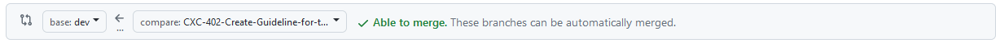
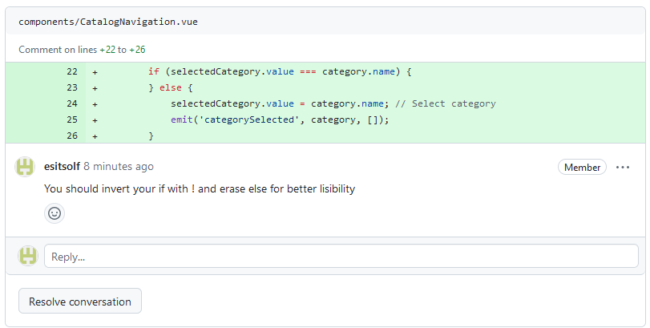

# How to create a PR

## Before creating the PR

- **Merge Dev on your branch**
- Remove the console.logs that you didn't removed yet
- Review your code to be sure that you remove all what is unnecessary
- Deploy your code on netlify
- Be sure that you commited and pushed your last changes 
- Test your code as explained here [Test](/test-procedure-guideline.md) 
 
***Great! You are ready to create your PR !!***

## Create the PR

- Go to the github of our project: https://github.com/comixcraft/Editor
- If you did everything correctly, you should see something like that:

- Click on Compare & pull request
- You should see that at the top: 
  
    

  - Be sure that base: dev is selected
  - Be sure that compare: "your branch" is selected
  - Be sure that "able to merge" appears in green (if not, you should first merge dev back into your brach and do the PR after)

- Add a title *(can be the name of the branch)*
- Add a description
  - With the main news that your PR is bringing
  - The big bugs you encountered meanwhile coding and how to reproduce them *(to be sure that you solve them)*
  - Points that you are not sure you did as you should
  - Points that you want the reviewer to pay special attention on
  - The link of your deployed version
- ***Optional*** Choose one or more reviewers by clicking on Assignees => the best would be to have someone that is not using the same OS as you
- Add a label
- Click on Create Pull Request
- Write on the discord ***Review*** Channel that you create a new PR, Tag the Assignees if you entered some, otherwise tag everyone.

***Great! You created your PR !!***

## When the reviewer ask for changes

- Go on github
- Read the comments of the reviewer, it look like that:

  - Be open for feedback => no one wants to bother you
  - Keep a critical eye => You know want you did, sometimes the feedback/opinion of the reviewer won't work on your specific code
  - if you don't agree with the comment, you can either directly contact the reviewer or comment back
  - ***only the reviewer should close the conversation***
- Do the changes if needed
- Commit and push again
- Check that dev is still merge on your branch (another PR could have been accepted in between)
- Ask for a new review (up right on the PR screen)

## When the PR is accepted

Go to the discord Channel and write a message @everyone and give a list of files that you changed.

If there are specific points that were bringing bugs, mentions them too, so that everyone can have a small look on these points.

***Congratulation!! Your PR is now merged and closed!!***
