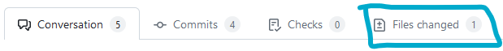
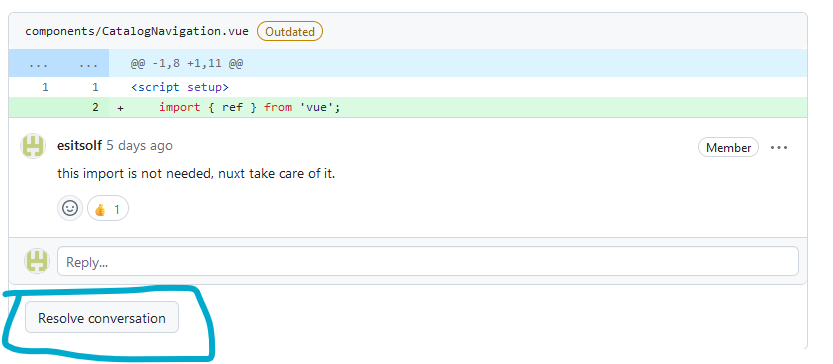
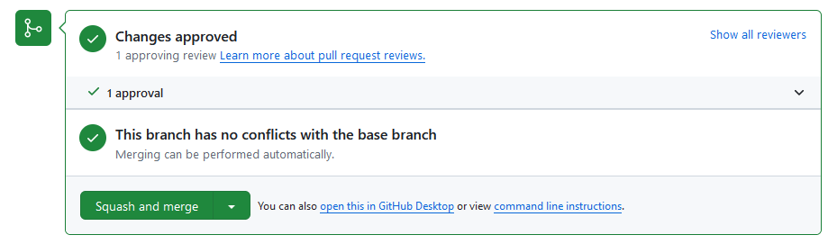
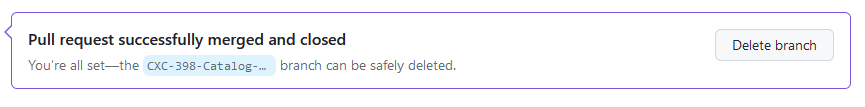

# How to Review a Pull Request

## First Review

1. If you are **not** marked as reviewer, inform the others on discord, that you start reviewing a PR.
2. Go on *[Jira](https://fhstp-team-imewas3gbc47.atlassian.net/jira/software/projects/CXC/boards/2)* and read the task that the PR is solving.
3. Go on the *[PR page](https://github.com/comixcraft/Editor/pulls)* and click on the PR you want to review.
4. Read carefully the description of the PR.
5. Test the app following the *[test procedure](./test-procedure-guideline.md)*. Pay particullar attention on the bug/new feature the PR brings
   1. on the deployed version if one
   2. on local if there are no deployed version. *(remember to checkout the according branch if you test on local)*
6. Go back to github and open the Files Changed tab of the PR

7. Read the new part of the code with critical eyes and try to find:
   1. inconsistency
   2. unused code
   3. forgotten console.log
   4. unused imports
   5. Code that is not following our *[guidelines](./component-guidelines.md)*
   6. things that could be improved in readability
   7. Things that could improve the performance of the app
8. Mark what you find and add a comment that explains your findings 
   1. *you can drag and drop directly on the lines of the new file, to mark specific lines of code and open the comment editor*
   2. *You can mark a single line on clicking on it*
9.  Once you're done reviewing a file, click on the "viewed" checkbox on the top of the file

10.   Once you are done with all files, click on the arrow next to "Review Changes" on the top right of the PR page

11.  A popup opens. Now you have to choose an option
     1. Comment => you only comment it, it is like opening a conversation about something.
     2. Approve => everything is find, you give your approval ***Please see the part "Accept and merge a PR!"***
     3. Request changes => you found things that should be changed.
12.  Write a comment about the PR in general
13.  Click on ***submit Review***
14.  Inform the creator of the PR that you are done reviewing

## Next round of Review
You requested changes on your last review. The creator did them and asked you to review again.
1. Open the PR page again.
2. Check that the changes you requested were made or that a reason were given why they were not.
3. Resolve the conversations if you agree with the changes, or contact the creator of the PR to make things clear between you two if not. **only the reviewer should resolve the conversation**

4. Test the app again
5. Restart the process of making a review until everything is ok.

## Accept and merge a PR
If you want to do this, it means that: 
1. You tested the app following the *[test procedure](./test-procedure-guideline.md)*
2. The code is clean 
3. All conversations are resolved
4. You submited your review as "Approved"
 
**Great! Everything is fine! you are almost there!**

Here is what's left: 
1. Go to the PR page again.
2. scroll down until the bottom until you see this (if it's not green, something is wrong):

1. Click on ***Squash and merge***
2. Be sure that the commit message is filled
3. click on ***Confirm Squash and merge***
4. click on ***Delete Branch***

5. Inform the creator that the branch is merged

***Good job! You did it!***
